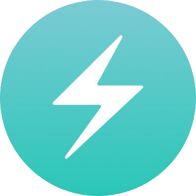

## Hi, I'm Octavio! 👋

I’m a Frontend developer, I have a great passion for code and music, I strive to learn something new every day.
 

 
 
  <a href="https://github.com/Octaviocossy">
  
  

## About me

- 🌱 I'm currently working with ReactJS.
- 📚 I'm currently coursing TUP in UTN.
- ✨ I'm looking to contribute to open source projects.

## Languages and Tools

<code></code>
<code></code>
<code></code>
<code></code>
<code></code>
<code></code>